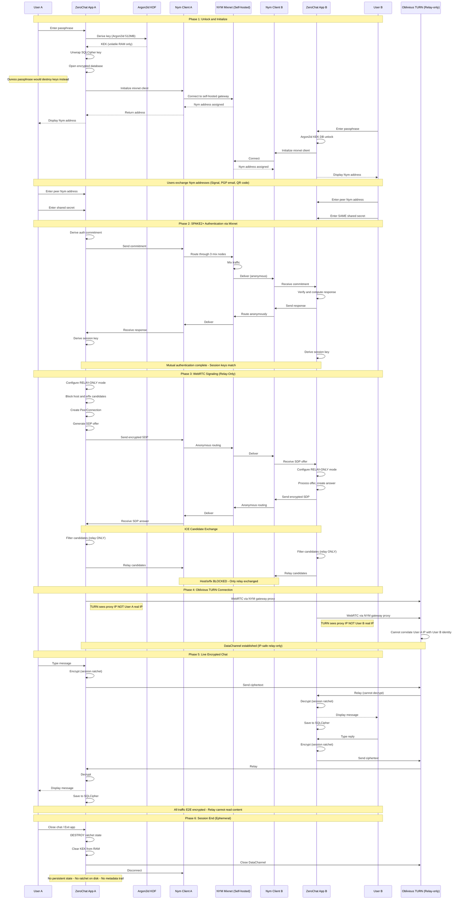

# ZeroChat - Journalist-Grade Anonymous Messaging (Phase 1)

**Threat Model**: State-level adversaries, device seizure, coercion  
**User Profile**: Journalists, activists, whistleblowers  
**Design Philosophy**: Anonymity over availability, unlinkability over convenience

---

## ⚠️ Critical Security Posture (Phase 1)

> [!CAUTION]
> **This is NOT a general-purpose messaging app.**
> - **Both users must be online** - No offline messaging in Phase 1
> - No delivery guarantees
> - No persistent sessions
> - No direct P2P connections (relay-only)
> - Connection failure preferred over metadata leakage
> - Designed for short-lived, high-risk communication only

---

## Threat Model

| Adversary Capability | Mitigation |
|---------------------|------------|
| **Global passive surveillance** | NYM mixnet prevents traffic analysis |
| **ISP/network monitoring** | Oblivious relay prevents IP correlation |
| **Device seizure** | Passphrase-based encryption, Keystore NOT trusted |
| **Coercion/duress** | Duress passphrase triggers key destruction |
| **Metadata analysis** | No persistent state, no delivery receipts |
| **Long-term correlation** | Session-scoped encryption only, no ratchet persistence |
| **Compromised TURN** | Strict metadata separation, connection fails if violated |
| **IP address disclosure** | WebRTC relay-only mode, no direct P2P |

---

## Architecture Decisions

| Component | Choice | Security Rationale |
|-----------|--------|-------------------|
| **Mixnet** | Self-hosted NYM (open source) | No dependency on paid services, full control |
| **WebRTC Mode** | **RELAY-ONLY** (no P2P) | Prevents IP disclosure to peers |
| **ICE Candidates** | Relay candidates ONLY | Host/srflx candidates blocked |
| **Relay** | Oblivious TURN or FAIL | Metadata separation enforced, no IP leakage |
| **Encryption** | Session-scoped ratchet | No persistent state = no long-term metadata |
| **Key Storage** | Passphrase → Argon2id → KEK | Android Keystore NOT trusted as anchor |
| **Offline** | **NOT IMPLEMENTED** (Phase 2) | Live communication only for now |
| **Duress** | Alternative passphrase → key wipe | Coercion resistance |

---

## Technology Stack

### Core Platform
- **Language**: Kotlin 1.9+
- **Build**: Gradle 8.x with Kotlin DSL
- **Min SDK**: API 26 (Android 8.0) 
- **Architecture**: Clean Architecture + MVVM
- **DI**: Hilt (Dagger-based)
- **Concurrency**: Kotlin Coroutines + Flow

### UI Layer
- **Framework**: Jetpack Compose
- **Material**: Material 3 (dark mode only)
- **Navigation**: Compose Navigation
- **Design**: Privacy-focused (deep purples, dark grays)

### Anonymity & Transport
- **Mixnet**: Nym Rust SDK (self-hosted)
  - Compiled to Android via UniFFI
  - Custom mixnode topology support
- **Fallback**: Tor integration (if Nym unavailable)
- **WebRTC**: Google libwebrtc (relay-only mode)
  - ICE transport policy: RELAY
  - Host/srflx candidates blocked

### Cryptography
- **Library**: Lazysodium-android (libsodium wrapper)
- **KDF**: Argon2id 
  - Memory: 512MB
  - Iterations: 3
- **E2E**: Session-scoped ratchet (NOT persistent)
  - X3DH for initial key agreement
  - Symmetric ratchet within session only
- **Key Storage**: Passphrase-based (NOT Android Keystore)

### Storage
- **Database**: Room + SQLCipher
  - AES-256-GCM encryption
  - Key wrapped by passphrase-derived KEK
- **Entities**: Messages (ephemeral), Sessions (temporary)
- **NO persistent**: Contact lists, ratchet state, metadata

### Self-Hosted Infrastructure
- **NYM Mixnet**: 3+ self-hosted mix nodes
- **Oblivious TURN**: Self-hosted coturn + proxy
- **Cost**: ~$30/month for 4 VPS (or free with Oracle Cloud)

---

## Complete Working Flow - Phase 1 (Live Chat Only)

---

## Implementation Phases

### Phase 1: Project Bootstrap
- Create Android project (Kotlin + Compose)
- Set up Rust toolchain for Android
- Configure Gradle for UniFFI integration

### Phase 2-7: As per TASKS.md

### Future: Offline Messaging (Phase 2)
Dead-drop implementation deferred to Phase 2

---

**Ready to begin Phase 1 implementation?**
