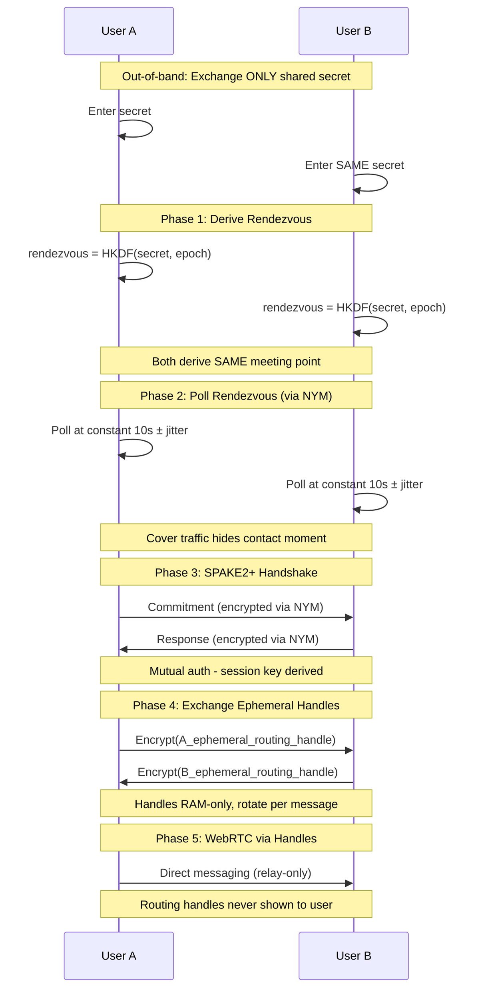

# ZeroChat - Phase 1 Implementation Plan

**Threat Model**: State-level adversaries, device seizure, coercion  
**Design**: Anonymity over availability, unlinkability over convenience

---

## ⚠️ Phase 1 Limitations

> [!CAUTION]
> - **Both users must be online** - No offline messaging
> - No delivery guarantees
> - No persistent sessions
> - Connection failure preferred over metadata leakage

---

## Peer Bootstrap: Secret-Only Exchange

### Before (Removed)
```
User exchanges: Shared Secret + NYM Address A + NYM Address B
❌ 3 pieces of information, UX friction, operational risk
```

### After (Implemented)
```
User exchanges: ONLY Shared Secret
✓ 1 piece of information, minimal friction
✓ NYM addresses derived and handled by app
✓ Routing handles never shown to user
```

---

## Connection Flow (Secret-Derived Rendezvous)



---

## Technology Stack

| Component | Choice |
|-----------|--------|
| **Language** | Kotlin 1.9+ |
| **UI** | Jetpack Compose |
| **Mixnet** | Self-hosted NYM |
| **Crypto** | Lazysodium (Argon2id, HKDF, SecretBox) |
| **DB** | SQLCipher (passphrase-derived key) |
| **WebRTC** | Relay-only mode |

---

## Security Properties

| Property | Implementation |
|----------|----------------|
| **No user-visible identifiers** | Addresses derived internally |
| **Ephemeral rendezvous** | TTL ≤ 5 min, epoch-rotated |
| **RAM-only routing handles** | Never persisted |
| **Constant-rate polling** | 10s ± 2s jitter |
| **Duress protection** | Alternative passphrase → wipe |
| **Failure = silence** | No retries, no distinguishable errors |

---

## Files Changed

| File | Change |
|------|--------|
| `ConnectScreen.kt` | Remove NYM address input |
| `RendezvousManager.kt` | NEW: Derive + poll rendezvous |
| `RoutingHandleManager.kt` | NEW: Ephemeral handle lifecycle |
| `KeyManager.kt` | Add HKDF derivation |
| `SECURITY_GUARDRAILS.md` | NEW: Audit checklist |

---

See [SECURITY_GUARDRAILS.md](./SECURITY_GUARDRAILS.md) for enforceable invariants.
