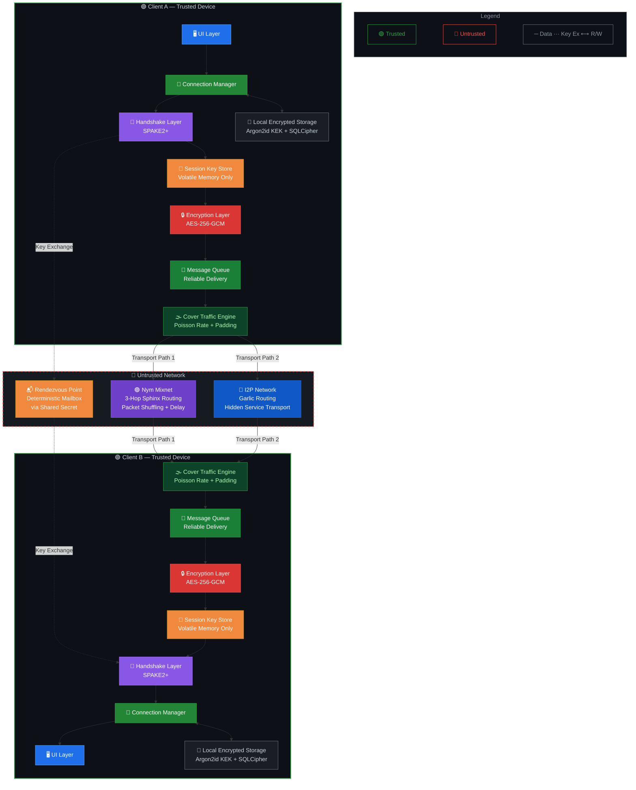

# Architecture

This document provides a high-level overview of the ZeroChat system architecture and the data flow between its core components.

## Architecture Diagram

The system is separated into strict trust boundaries. The local client device is trusted (green), while all intermediate routing and networks are considered untrusted (red).

## Data Flow Diagrams

The detailed flow of data is broken down into three main phases.

